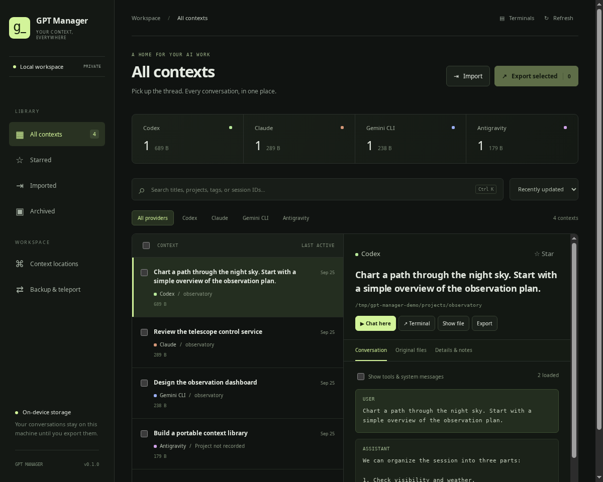
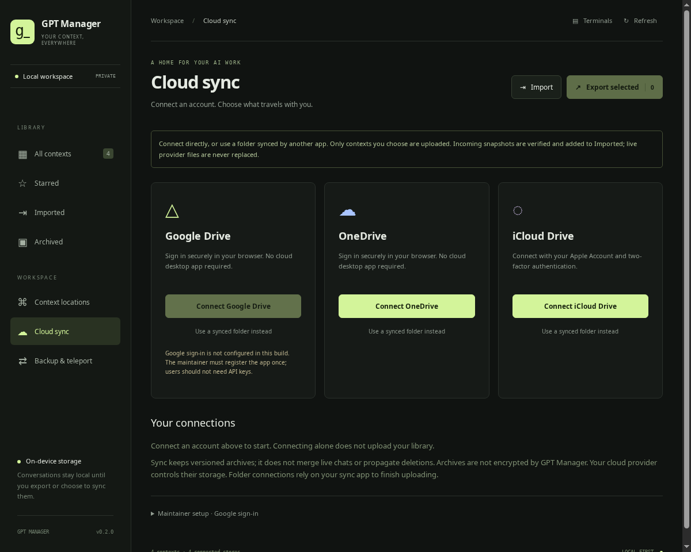

# GPT Manager

[Project website](https://anolis.github.io/gpt-manager/) · [Cloud setup](#cloud-sync) · [Moving contexts](#moving-contexts)

A local desktop library for Codex, Claude Code, Gemini CLI, and Antigravity / agy conversations. Browse provider stores, inspect transcripts and original files, organize contexts, resume a conversation in a terminal, and carry contexts between machines.



## Run

**Linux:** download and run the installer as your normal desktop user:

```sh
curl -fsSL https://raw.githubusercontent.com/anolis/gpt-manager/main/install-linux.sh -o /tmp/gpt-manager-install.sh
bash /tmp/gpt-manager-install.sh
```

Then open **GPT Manager** from your application menu. The installer handles system dependencies, downloads a checksum-verified Node runtime, installs the locked app dependencies, and registers the app icon. You do not need to configure Node or `nvm`. It requests sudo for system packages and, where required, an app-specific AppArmor rule that keeps Electron’s sandbox enabled.

Supports x86_64 and ARM64 on glibc Linux, with automatic packages for Debian/Ubuntu, Fedora, Arch, and openSUSE families. A graphical desktop and a distribution providing Python 3.10+ are required. The installer does not change global Node installations or install/sign into AI providers; use **AI setup** inside the app for those.

Run the same commands again to **update**. The app switches to the new version only after dependency and runtime checks succeed; earlier versions remain available to already-running sessions. Restart GPT Manager after updating.

To **uninstall**:

```sh
~/.local/bin/gpt-manager-uninstall
```

Close GPT Manager first. This removes installed app versions, launchers, icons and its AppArmor profile, while retaining conversations, credentials, application settings and system packages. App files live in `${XDG_DATA_HOME:-~/.local/share}/gpt-manager-app`; the command lives in `~/.local/bin/gpt-manager`. Run `bash install-linux.sh --help` for `--ref`, `--source`, and `--skip-system-deps` options. To install your current local checkout, use `bash install-linux.sh --source .`.

Windows 11 x64 builds bundle the backend and Python. Download the installer from [Releases](https://github.com/anolis/gpt-manager/releases), run it for your user account, then open **AI setup**. Early builds are unsigned and may display an unknown-publisher warning. Native Windows folders and CLIs are supported; WSL is a separate environment.

To run from source, use the commands below. Requires **Node.js 22.12+** (24 recommended), **Python 3.10+**, and a graphical desktop. Linux is the first supported platform.

```sh
nvm use                    # if you use nvm; reads .nvmrc
npm install
npm start
```

If your npm configuration disables install scripts, download Electron's runtime explicitly:

```sh
node node_modules/electron/install.js
```

Use **AI setup** to install Codex, Claude Code, Gemini CLI, or Antigravity CLI (agy) and sign in inside the embedded terminal. Existing installations on PATH are preferred by default. AI setup lets you explicitly install/select a managed copy or switch back; running terminals keep their current client. GPT Manager preserves provider approval controls; it does not need a separate API key. `GPT_MANAGER_PYTHON` can select a Python executable. Browsing uses no network service and loads no remote UI. Cloud sync is opt-in: the connector runs an authenticated service on an ephemeral localhost port and sends only selected context archives to your chosen cloud. Provider sign-in can briefly use an OAuth callback port. Resuming a provider uses that provider's normal network behavior.

## What works

- One library with provider filters, metadata search, sorting, and multi-selection.
- Read-only store discovery, bounded scans for large histories, and paginated transcripts. The library searches titles, projects, tags, and IDs; it does not yet index full transcript text.
- Editable display titles, tags, notes, stars, and manager-only archive status.
- Provider root locations, additional custom roots, and reveal-in-file-manager.
- **Chat here**: real interactive PTYs rendered with xterm.js, up to eight terminal tabs. Tabs persist while navigating, resize with the window, and ask before stopping a running process.
- **Terminal**: opens a Linux system terminal or Windows PowerShell in the recorded project directory with the specific conversation resumed. Missing project directories trigger a folder picker.
- Portable `.gptctx` archives containing original context files, a versioned manifest, SHA-256 checksums, and manager annotations.
- Archive validation and preview, import into an isolated library, and explicit conflict-safe restoration of original files.
- Cloud account connections, optional synced-folder connections, manual sync, and opt-in automatic snapshot sync.
- Project-folder remapping and original-context-file moves with a recovery archive and conflict checks.

### Discovery and resume adapters

| Provider | Default store | Resume command |
| --- | --- | --- |
| Codex | `$CODEX_HOME` or `~/.codex`, including `sessions` and `archived_sessions` | `codex resume SESSION_ID` |
| Claude Code | `$CLAUDE_CONFIG_DIR/projects` or `~/.claude/projects` | `claude --resume SESSION_ID` |
| Gemini CLI | `~/.gemini/tmp/*/chats/session-*.json` | `gemini --resume SESSION_ID` |
| Antigravity CLI | `~/.gemini/antigravity-cli` | `agy --conversation SESSION_ID` |
| Antigravity IDE | `~/.gemini/antigravity` | Binary preservation and readable transcript inspection where available; no IDE resume adapter |

Codex/Claude custom roots are passed through their environment variables when resuming. Other custom stores can be inspected and exported, but their CLI must already be configured to find them. Gemini sessions are project-specific; choose the correct folder if the file does not record it. agy workspace paths are read from cached metadata, the summary database, or matching history entries when available.

CLI syntax was checked against installed `codex`, `claude`, and `agy` help, the [official Codex CLI documentation](https://learn.chatgpt.com/docs/codex/cli), and [Gemini session management](https://geminicli.com/docs/cli/session-management/). Store formats are not stable public APIs, so adapters tolerate missing fields and preserve original files. Electron uses a sandboxed renderer, context isolation, and a restricted preload bridge following its [security guidance](https://www.electronjs.org/docs/latest/tutorial/security).

## Backup, restore, and teleport

1. Select contexts and choose **Export selected**. Use a new `.gptctx` filename.
2. Move that file to another machine using your preferred transfer channel.
3. In the other GPT Manager, choose **Import**, review the verified archive, and import it into the library.
4. Read imported contexts immediately. To resume natively, choose **Restore files** on an imported context and select the destination provider root, or use an empty staging folder to inspect the restored layout first.
5. Refresh the manager after restoring to a connected provider store, then resume the local copy.

Portable archives work offline. SSH endpoints also support a guided **Resume here** handoff, described below. Cross-provider conversion and history merging are not implemented. Imported contexts are library copies until explicitly restored. Restore rejects conflicts and does not overwrite files. Provider source files are untouched by browsing and organization.

Archives are **not encrypted** and contain private conversations and potentially sensitive tool outputs. Global authentication files, settings, provider indexes, and source repositories are not exported. Claude session companion files and Antigravity conversation databases/brain artifacts are included. SQLite databases use the SQLite backup API to include committed WAL data. Transcripts are copied up to their initial length; a concurrent last partial record is retained but skipped by the viewer. Pause active agents for the most coherent multi-file backup.

A native provider may need its index rebuilt or a matching project checkout before it can resume a restored session. Original project paths are preserved, not rewritten. In particular, Antigravity has shared summary/index state beyond the per-conversation database. **Archive round-trips and file restoration are tested; seamless native resume after migration is not guaranteed.** Backup whole provider installations separately when you need complete application-state disaster recovery.

## Guided AI setup

1. Open **AI setup** and choose **Install managed copy** under Codex, Claude Code, Gemini CLI, or Antigravity CLI (agy).
2. Follow the runtime download progress, dependency installation stage, and CLI verification. Cancel or retry if necessary.
3. Choose **Sign in**. Complete the provider's prompts and browser flow in the embedded terminal. Gemini and Antigravity open their interactive onboarding screens; exit after signing in.
4. Open **Catch up** and select Codex or Claude to generate a recap, or resume a conversation from the library. Installing a CLI does not create a provider account or subscription. Each card shows installation and sign-in status separately. Codex and Claude report their CLI login state; Gemini shows whether local credentials are configured, without claiming they are verified. Antigravity account status must be checked in its own terminal; API-key configuration is reported as unverified. Status refreshes after the sign-in terminal exits, or when you choose **Refresh installation & sign-in status**.

For Codex, Claude and Gemini CLI, the manager downloads Node v24.18.0 from nodejs.org and checks a pinned SHA-256. It installs the official stable npm packages into separate directories under its user-data `providers` folder, using npm's package integrity checks. No sudo, administrator rights, global npm changes, manual PATH changes, or separate Node install are needed. Failed upgrades preserve the prior managed version; older versions are retained for running terminals. Installed managed copies show **Uninstall managed copy**, with a separate **Update managed copy** action. Updates preserve your selected CLI source. Uninstall removes only GPT Manager’s provider packages and retains credentials, conversations, and existing external CLIs; close managed terminals and wait for active checks first. Authentication stays in each provider's normal store. Antigravity CLI uses Google’s official platform release manifest and SHA-512-verified native download, with progress and cancellation, inside the same managed directory. It does not need Node or change your shell PATH. The CLI may self-update during normal use; the displayed managed version records the last manager installation. The Antigravity IDE is installed separately.

Package installation follows [Codex CLI](https://learn.chatgpt.com/docs/codex/cli), [Claude Code setup](https://code.claude.com/docs/en/setup#install-with-npm), [Gemini CLI installation](https://geminicli.com/docs/get-started/installation/), and [official Antigravity CLI installation](https://antigravity.google/docs/cli/install/). The Windows workflow validates real provider installation and `--version` without signing in or sending prompts.

### Building the Windows installer

Build on Windows with Node 24, Python 3.13, and the Visual Studio C++ build tools required by node-pty:

```sh
npm ci
python -m pip install pyinstaller==6.19.0
npm run dist:win
```

The NSIS installer appears in `dist`. CI builds on a native Windows runner, tests locks, archives, official CLI installation, the packaged backend, and ConPTY input/resize/exit, then uploads the installer artifact. Python is frozen with PyInstaller and shipped alongside Electron. Code signing is not configured yet. Account sign-in and real provider resume still need interactive Windows user validation.

## Provider usage

Open **Usage** for provider-reported remaining allowance, quota windows, and natural reset times in your local timezone. These are account quotas, not context-window fullness or estimates from transcript token counts. Only local CLI accounts are queried; remote SSH accounts are separate.

- **Codex:** reads the signed-in CLI's [account/rateLimits/read](https://learn.chatgpt.com/docs/app-server) over stdio, without starting a thread or model turn. Refreshes once a minute while the tab is visible, with a 30-second minimum interval. API-key accounts may not expose subscription limits.
- **Claude:** Refresh reads subscription limits using the local Claude OAuth login (`CLAUDE_CONFIG_DIR/.credentials.json`, default `~/.claude`, or `CLAUDE_CODE_OAUTH_TOKEN`). Credentials stay in the backend and are sent only to Anthropic’s fixed usage endpoint, never to redirects or the renderer. No model request or token refresh is made. Expired logins require signing in again; rate-limited checks back off. This endpoint is used by Claude Code but is not a stable public integration API. API-key accounts do not provide subscription quotas.
- **Claude terminal fallback:** optionally enable the terminal meter and restart a local Claude terminal launched by the manager. The [official status-line fields](https://code.claude.com/docs/en/statusline) report 5-hour/7-day or gateway spend limits after an API response when available. This also covers accounts whose credentials cannot be read directly, such as keychain-only logins. The manager supplies a per-session status line, leaving your settings file unchanged; it replaces a custom status line for those sessions. Only quota values, reset times, reporting store and capture time are cached, never the status-line input or transcript.
- **Antigravity:** Refresh runs the installed `agy -p /usage --output-format json` and displays reported quota buckets and reset times. The manager checks for version 1.1.11+ first: older versions can interpret slash commands as model prompts and are never queried this way. Modern versions [answer this command without starting an agent turn](https://github.com/google-antigravity/antigravity-cli/blob/main/CHANGELOG.md). Sign in or update through **AI setup** if needed.
- **Gemini:** automated quota reporting is not integrated. Use `/stats model` in Gemini CLI.

Every snapshot has its capture time. Expired windows show **awaiting a fresh report**, rather than claiming the quota has refilled. Failed refreshes retain the last report with an error message.

## Catch up: daily and weekly work recaps

Open **Catch up** to reconstruct your own working context across projects. Choose **Yesterday**, **Today**, **Last 7 days**, **Last week (Monday–Sunday)**, or custom dates up to 93 days. Day boundaries use the desktop’s local timezone, including daylight-saving changes.

1. Choose **Review activity**. GPT Manager reads dated user/assistant excerpts from local native and imported conversations. Optionally include connected SSH histories. No model is called at this step.
2. Review the excerpts and choose which conversations to include. Matching snapshots from imported/teleported copies are deduplicated. A missing timestamp is reported and excluded; modification dates are never treated as evidence of work on that day.
3. Select an installed, authenticated **Codex** or **Claude** CLI, optionally specify a model, and choose **Generate recap**. Selected excerpts and their project/title/machine labels are sent through that provider account, subject to its normal usage limits/charges. Both generators can summarize histories from all four supported context providers.
4. Read the project summaries, decisions/outcomes, open work and suggested next steps. Links open the source conversations in the inspector. Saved recaps retain their reviewed excerpts, date range, generator and coverage warnings. You can copy or delete a saved recap.

Generation uses a separate temporary working directory and does not resume/edit the original conversations. Codex uses ephemeral execution, read-only sandboxing, ignored user config, and disabled shell/web/agent features; Claude uses safe mode, no tools/MCP, and disabled session persistence. Recent CLI versions supporting these flags are required; sign in through the provider CLI first. Managed provider policies still apply. See [Codex noninteractive execution](https://developers.openai.com/codex/noninteractive) and [Claude CLI flags](https://code.claude.com/docs/en/cli-reference). The app checks returned project/source references before saving. This does not verify every generated claim: summaries remain AI interpretations of the excerpts, not a complete activity audit.

Coverage is deliberately bounded: up to 250 histories and 128 MiB per review, the latest 4 MiB of each JSONL history (JSON files must fit within 4 MiB), up to 6,000 excerpt characters per conversation, and at most 24 conversations / 100,000 input characters per recap. Earlier activity outside a sampled tail can be missing; coverage warnings appear in both preview and saved recap. Raw tool output, undated messages and opaque provider stores are not used. Recaps are on-demand, not scheduled, and local-model generation is not implemented yet.

Saved recaps live in `<manager data>/catch-up` with private directory/file permissions. They include conversation excerpts, are not encrypted, and are not included in context exports or cloud sync. Preview data remains in memory. Cancellation stops the summary subprocess; a five-minute timeout and bounded output prevent a stuck provider from running indefinitely. Tests cover actual subprocess orchestration using a synthetic provider, date/DST boundaries, deduplication, citation validation, persistence and cancellation. Live-account summary generation still needs user validation.

### Automatic daily recaps

In **Catch up → Automatic daily recap**, choose a local time (default 09:00), Codex or Claude, and optional model/SSH histories, enable the schedule and save. It starts disabled. Enabling authorizes sending sampled excerpts and project labels from all readable local/imported histories (including archived contexts) automatically without manual selection; the same coverage bounds, duplicate filtering and provider charges apply. One provider can summarize all supported services.

It summarizes **yesterday**, saves the result in **Saved recaps**, and runs while the app is open or minimized. If opened after the scheduled time it runs then; it does not backfill older missed days. No dated activity means no model call. Manual work already in progress defers the scheduled start. Attempts are recorded before starting, so failures, cancellation and restarts do not silently retry/bill again that day. Turn the schedule off to cancel a daily run. Use a manual recap to retry. Schedule times follow the computer's local timezone, including daylight-saving transitions.

## SSH context locations and Resume here

Open **Context locations → Add SSH endpoint**. Choose a named alias from `~/.ssh/config` (including `Include` files), or enter `user@hostname`. Wildcard/negated Host patterns are not offered as aliases. OpenSSH remains responsible for ports, jump hosts, identities and other configuration.

In the context library, use **Host** alongside the provider filters to show all hosts, this machine (including imported copies), all SSH hosts, or one endpoint. Offline endpoints remain selectable for browsing cached contexts. Host filtering also works with search, Starred, and Archived views.

- **Scan local network** discovers SSH banners on port 22 in a selected, directly attached private IPv4 subnet. Scans are explicit, limited to the local /24 (or smaller), and use at most 32 concurrent connections. They do not authenticate or accept host keys. IPv6, nonstandard ports and routed subnets require a manually added endpoint or alias.
- First connect using your system SSH client to verify the host key and set up key/agent authentication. GPT Manager requires existing host trust and noninteractive authentication; it never disables host-key checking or copies private keys. Hosts need Python 3.10+, a POSIX environment, and their authenticated provider CLIs on the SSH command PATH.
- Remote discovery reads native stores and the remote manager’s default settings/annotations through a temporary Python helper. It does not require installing GPT Manager on the remote host. Remote imports are not listed. Library rows, inspectors and terminal tabs identify the execution machine. Refresh scans configured endpoints; failed refreshes retain the in-memory snapshot with an offline label.
- **Resume remotely** runs the provider on the source host inside the embedded SSH terminal. **Terminal** uses an external local terminal to run that SSH session. Remote browsing is read-only; provider interaction occurs on that host.

Choose **Resume here** to hand off a remote conversation to this machine:

1. Stop any external provider sessions using it. Choose an existing local project folder, or copy the remote work folder using **Place folder with files** (select a parent directory) or **Place files in folder** (select an empty destination for its contents). For example, choosing `~/repos` for a remote project named `observatory` creates `~/repos/observatory`. With **Place folder with files**, an existing child folder (even an empty one) is never replaced; choose another parent or use one of the other placement options.
2. For an existing Git checkout with an upstream, GPT Manager fetches and checks available commits. It asks before applying a fast-forward update. Dirty or divergent checkouts are never automatically merged, reset or stashed. Keeping current files does not bring over source workspace changes or unpushed commits.
3. The source receives a handoff reservation. The archive is transferred over SSH, validated, imported and restored into the local provider’s default store without replacing existing sessions. An optional workspace copy includes `.git`, hidden files, dependencies and uncommitted changes. It is limited to 16 GiB / 100,000 entries, detects changes during capture, and only preserves symlinks within the project. Linked Git worktrees/external `.git` directories require an existing local checkout.
4. The local project mapping is saved and the local terminal opens. Gemini JSON sessions are placed in the destination project’s registered bucket (or legacy path hash) and get a matching project hash; the imported archive retains the original. Provider credentials, global indexes, installed CLIs and historical path references are not rewritten or transferred with the conversation. Native resume remains dependent on the installed provider version.

The source files remain as a backup, marked **handed off**. Cooperative locks in `~/.local/state/gpt-manager/session-locks` prevent competing GPT Manager launches of a provider/session on the same host/account. Reservations survive app restarts. Source context changes during capture/finalization are detected; a failed transfer releases the reservation when reachable, while a successful local restore keeps the source reserved even if final confirmation fails. Local recovery receipts are stored under `<manager data>/handoffs`.

To bring the latest history back to a previous machine, stop the destination session, refresh its SSH endpoint on the previous machine, and choose **Resume here** on that SSH copy (or **Resume here from …** on the retained local copy). The manager verifies the original handoff receipt on the current source and checks that the retained copy has not changed. It saves a portable archive and rollback files under `<manager data>/handoff-backups`, restores the latest history, and clears the old local reservation while reserving the other host. If the retained conversation changed, a confirmation offers **Trash local changes and continue**: this uses the SSH conversation and saves the discarded local conversation in the recovery backup first. It does not discard project files. Changes made after confirmation abort the transfer, and a failed restore recovers the changed local copy. Unrelated duplicates and missing receipts are refused rather than merged. A failed restore rolls back the retained files; interrupted recovery leaves reservations in place and records the backup paths in the receipt. This also supports handoffs made before return transfers were added, provided their receipt remains in the default manager data directory.

**Release handoff** is manual recovery for reopening an older retained copy; it does not transfer newer messages. Stop the destination session before using it. The manager warns about other discovered native copies. These protections do **not** control provider sessions launched outside GPT Manager, older manager versions, or disconnected copies on other machines; they are not distributed consensus or history merging. If a handoff is interrupted, refresh both libraries and inspect the receipt/source state before retrying.

SSH transport, remote resume, workspace transfer, source blocking and release are tested against an isolated localhost OpenSSH server with synthetic contexts. Real provider resume behavior and platform-specific configurations still need user testing.

## Cloud sync



Open **Cloud sync** in the sidebar. Direct account sign-in is the primary path; **Use a synced folder instead** is available for each provider. No separate cloud desktop client or manual connector installation is required for direct connections: the first connection downloads pinned rclone v1.75.1 from its official HTTPS distribution and verifies its published SHA-256 checksum.

| Provider | Direct connection | Folder option |
| --- | --- | --- |
| Google Drive | Browser OAuth once the maintainer supplies GPT Manager’s OAuth registration; disabled until configured | Available now |
| OneDrive | Browser OAuth through rclone; select a drive if asked | Available now |
| iCloud Drive | Apple Account/password and two-factor challenge through rclone | Available now |

The connection flow and transfer engine are implemented. Automated tests cover the sign-in state machine and actual rclone transport against local-only remotes. **Live Google/Microsoft/Apple account authentication has not been verified in this environment.** Provider consent screens may identify the connector as rclone. iCloud uses its connector’s web authentication protocol, not Sign in with Apple. It requires the regular account password and web access to iCloud; trusted-device approval may be necessary, and sessions eventually need reauthentication. See [rclone’s iCloud documentation](https://rclone.org/iclouddrive/).

Connecting an account does **not** upload your library. Select contexts in the library, then choose **Use library selection** on the connection, or explicitly enable **Back up all unarchived local contexts**. Choose **Sync now** or opt into a 15-minute schedule while the manager is open. With no upload selection, a connection receives snapshots only.

Sync writes immutable `.gptctx` snapshots under `GPT Manager/v1`. Changed contexts and annotations create new snapshots; unchanged contexts are skipped. Incoming snapshots are validated and added to the imported library. Partial uploads are ignored, received archives are deduplicated, and no deletions or live provider-file changes are propagated. There is no transcript merge or automatic retention pruning. Old versions consume cloud storage until you remove them yourself. Folder mode can confirm a local write, but cannot confirm that your separate sync client finished uploading.

### One-time Google setup for maintainers

Google users should only have to sign in. This release cannot provide that experience until **GPT Manager has its own OAuth app registration**: rclone’s shared Google credentials are being retired in 2026. The application deliberately does not rely on those shared credentials. See the [official connector requirements](https://rclone.org/drive/#making-your-own-client-id).

1. In a Google Cloud project, enable the Drive API and configure the OAuth consent screen for GPT Manager.
2. Create an **OAuth Desktop app** client and download its JSON. Configure test users or publish the consent screen as appropriate for the intended audience.
3. In **Cloud sync → Maintainer setup**, import that JSON. Endpoint URLs in the JSON are ignored; the connector uses its built-in provider endpoints. GPT Manager requests the `drive.file` scope.
4. For a distributed build, supply `cloud-oauth.json` beside `package.json`, using the layout in [cloud-oauth.example.json](cloud-oauth.example.json). Normal users of that build will see an enabled Google connect button. Keep registration management with the maintainer.

Cloud credentials are stored in `<manager data>/cloud/accounts.conf` in an owner-only directory, with owner-only file permissions on POSIX. rclone obscures password fields; **this is not OS-keychain encryption**. OAuth configuration and account credentials are never included in context archives. Disconnect removes this manager’s local account configuration, not cloud snapshots or provider-side consent; revoke consent in the provider account if needed. Cloud archives themselves are not encrypted by GPT Manager.

## Moving contexts

Select a conversation and open **Details & notes → Move to another folder**.

- **Change project folder** changes the directory GPT Manager uses when launching the CLI. Codex receives an explicit `--cd` argument. It does not move your source repository, rewrite historical text, or update provider project indexes. Providers may retain paths in conversation memory; Gemini’s project-scoped session lookup may need its history placed in the appropriate provider bucket before it can resume from a different project.
- **Move original files** selects a new *provider store root*, preserving the provider’s relative layout. The app previews source/destination roots, creates a recovery `.gptctx` archive, checks conflicts, copies and verifies the bytes, then removes the original files. It carries over notes/tags/stars, registers the destination location, and updates cloud selections. A failed source removal attempts rollback; the recovery archive is retained under `<manager data>/move-backups`.

Close the conversation in external provider apps before moving files. Running embedded terminals block both actions; SQLite databases with WAL files cannot be moved until closed/checkpointed (Export remains available for snapshots). Moves do not transfer authentication, shared provider indexes, or project source files, and do not automatically enable native resume from a new store. Imported contexts use **Restore files** instead of moving the manager’s internal library copies.

The app and website share the original vector icon in `ui/assets/icon.svg`. PNG, Windows ICO and website exports are checked in; regenerate them with `python tools/build-icons.py` (ImageMagick + Pillow).

## Implementation

- Electron desktop shell with a sandboxed, local-only renderer.
- Python standard-library backend over private stdin/stdout RPC. Opt-in cloud operations use a separate authenticated, loopback-only rclone process.
- POSIX PTY subprocess bridge and xterm.js for embedded CLI interaction.
- Manager metadata and imported archives in Electron's user-data directory (`~/.config/gpt-manager` on typical Linux installations). The Locations screen shows the actual path.
- Override `GPT_MANAGER_HOME` and `GPT_MANAGER_DATA` for isolated fixtures or alternate environments. `CODEX_HOME` / `CLAUDE_CONFIG_DIR` still take precedence over home defaults.

Embedded terminals use POSIX PTYs on Linux/macOS and node-pty ConPTY on Windows 11. External terminals support Linux (`x-terminal-emulator`, GNOME Terminal, Konsole, or xterm) and Windows PowerShell. macOS remains unvalidated. SSH targets currently require a POSIX host with Python 3.10+; a Windows manager can browse and resume those hosts. Workspace copies containing symlinks can require Windows Developer Mode; existing local folders avoid that requirement. Git and OpenSSH remain optional system dependencies for Git checks and SSH locations.

## Verification

```sh
npm run check
npm test
```

The tests also cover two-manager cloud sync, deduplication, automatic-sync opt-in, rejected archives, installer checksums, sign-in response redaction, folder remapping, move recovery, and rollback. A separate `tests/cloud_connector_smoke.py` exercises actual rclone RPC with local-only remotes.

The tests cover provider parsing, annotation persistence, original-byte export/import/restore, conflict refusal, checksum tampering, path traversal, symlinks, undeclared files, SQLite WAL snapshots, pagination, and real PTY input/resize/exit. Resume-command tests verify provider arguments and reject invalid session IDs.

A desktop smoke test uses synthetic provider stores and a fake interactive CLI, never live conversations:

```sh
python3 tests/seed_demo.py /tmp/gpt-manager-demo
PATH="/tmp/gpt-manager-demo/bin:$PATH" \
GPT_MANAGER_HOME=/tmp/gpt-manager-demo \
GPT_MANAGER_DATA=/tmp/gpt-manager-smoke-data \
GPT_MANAGER_SCREENSHOT=/tmp/gpt-manager-desktop.png \
npm start -- --smoke-test
```

The smoke test requires a working graphical display. It checks discovery, transcript rendering, search, interactive PTY round-trips, and process exit, then captures the desktop and quits. Use the synthetic seed data exactly as shown; this test expects the fake `codex` executable.
